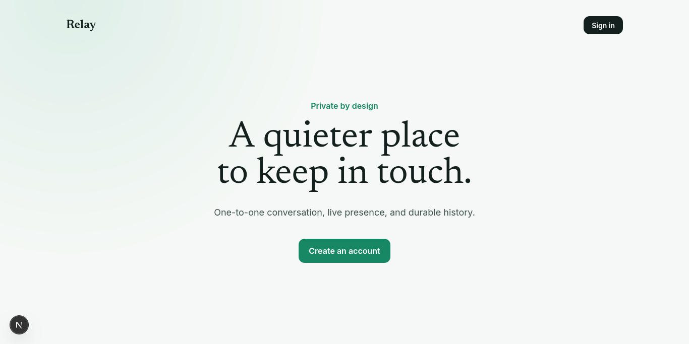
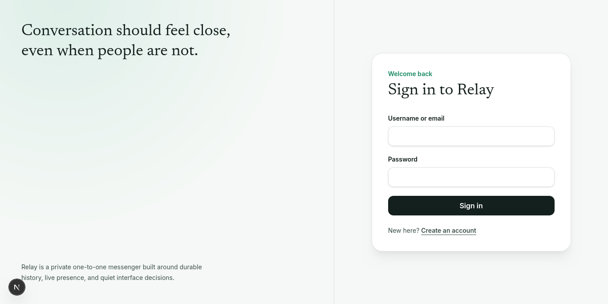
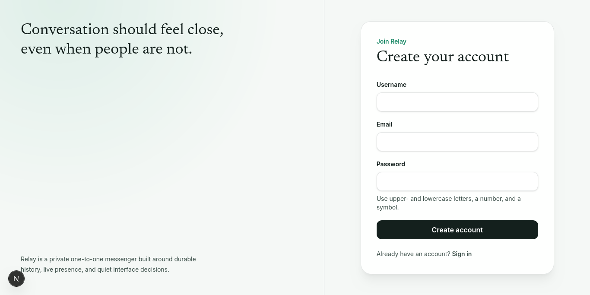

# Relay – Real-Time Chat

A private, one-to-one messaging application built with Next.js, Express, Socket.IO, and PostgreSQL.



---

## What is Relay?

Relay is a web application for private real-time messaging between two users. You can register an account, search for another user, start a conversation, and exchange messages that appear instantly on both sides without refreshing the page. The app tracks who is online, shows typing indicators, and marks messages as delivered and read.

It was built as a university Web Programming project, covering the full stack: a React/Next.js frontend, an Express REST API, a Socket.IO real-time layer, and a PostgreSQL database.

---

## Features

- User registration and login (username or email)
- Private one-to-one conversations
- Real-time message delivery via WebSockets
- Typing indicators
- Online/offline presence with last-seen time
- Delivery and read receipts
- Unread message badges in the sidebar
- Paginated message history
- Optimistic UI (messages appear before server confirmation)
- Fully responsive – works on mobile and desktop

---

## Technology Stack

| Layer | Technology |
|-------|-----------|
| Frontend framework | Next.js 16 (App Router) |
| UI library | React 19 |
| Language | TypeScript (both sides) |
| Styling | Tailwind CSS v4 |
| Real-time (client) | Socket.IO Client 4 |
| Backend framework | Express.js 5 |
| Real-time (server) | Socket.IO 4 |
| Validation | Zod 4 |
| ORM | Prisma 7 |
| Database | PostgreSQL |
| Auth | JWT + HttpOnly cookies + bcrypt |

---

## Project Structure

```
real-time-chat/
├── frontend/       Next.js application (UI, routing, client socket)
├── backend/        Express API + Socket.IO server
├── docs/images/    UI screenshots for documentation
├── README.md       This file
└── prompt.md
```

See [`frontend/README.md`](./frontend/README.md) and [`backend/README.md`](./backend/README.md) for detailed setup instructions for each service.

---

## Quick Start

### Prerequisites

- Node.js 20+
- PostgreSQL 14+

### 1 — Clone

```bash
git clone <repository-url>
cd real-time-chat
```

### 2 — Backend setup

```bash
cd backend
cp .env.example .env
# edit .env — fill in DATABASE_URL, JWT_SECRET, FRONTEND_ORIGIN
npm install
npx prisma migrate dev
npm run dev
```

Backend runs at `http://localhost:4000`.

### 3 — Frontend setup

```bash
cd frontend
cp .env.example .env
# edit .env — set BACKEND_URL and NEXT_PUBLIC_SOCKET_URL to http://localhost:4000
npm install
npm run dev
```

Frontend runs at `http://localhost:3000`.

---

## Screenshots

| | |
|--|--|
|  |  |
|  |  |

---

## Architecture Overview

```
Browser
  │
  ├── HTTP (REST) ──► /api/backend proxy ──► Express API ──► PostgreSQL
  │
  └── WebSocket ──────────────────────────► Socket.IO ──────► PostgreSQL
```

The browser never talks directly to the Express server over HTTP — all REST calls go through a Next.js proxy route (`/api/backend/[[...path]]`) which forwards requests and cookies transparently. The WebSocket connection goes directly from the browser to the backend.

---

## Report

A compiled academic report (`report.pdf`) can be found [here](docs/report.pdf)
